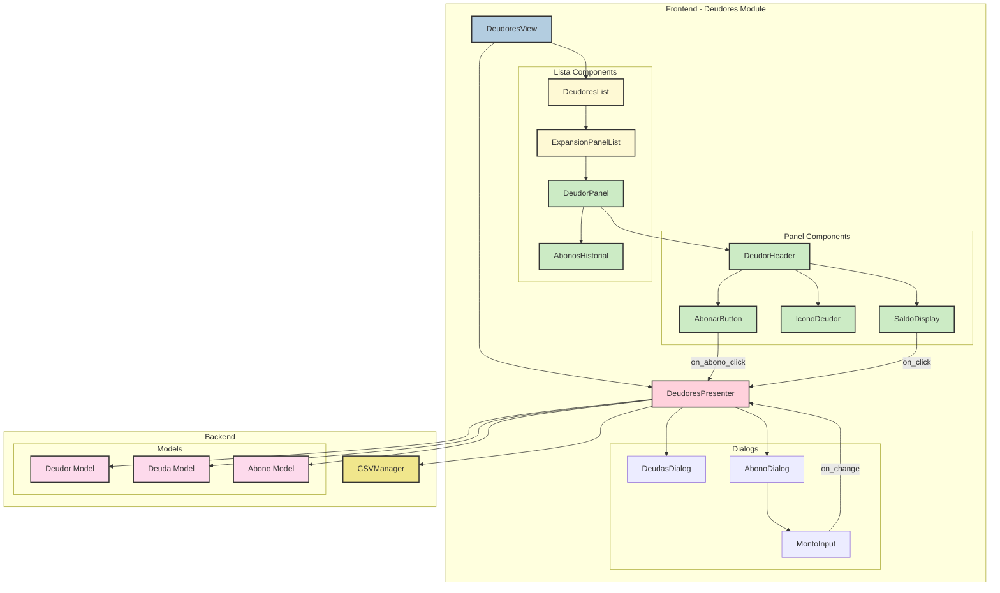

```mermaid
flowchart TB
    subgraph Frontend["Frontend - Deudores Module"]
        direction TB
        DeudoresView[DeudoresView]
        DeudoresPresenter[DeudoresPresenter]
        
        subgraph Lists["Lista Components"]
            DeudoresList[DeudoresList]
            ExpansionPanelList[ExpansionPanelList]
            DeudorPanel[DeudorPanel]
            AbonosHistorial[AbonosHistorial]
        end

        subgraph Panels["Panel Components"]
            DeudorHeader[DeudorHeader]
            SaldoDisplay[SaldoDisplay]
            IconoDeudor[IconoDeudor]
            AbonarButton[AbonarButton]
        end

        subgraph Dialogs["Dialogs"]
            DeudasDialog[DeudasDialog]
            AbonoDialog[AbonoDialog]
            MontoInput[MontoInput]
        end
    end

    subgraph Backend
        CSVManager[CSVManager]
        subgraph Models
            DeudorModel[Deudor Model]
            DeudaModel[Deuda Model]
            AbonoModel[Abono Model]
        end
    end

    %% Relaciones principales
    DeudoresView --> DeudoresPresenter
    DeudoresView --> DeudoresList
    DeudoresList --> ExpansionPanelList
    ExpansionPanelList --> DeudorPanel

    %% Relaciones del panel
    DeudorPanel --> DeudorHeader
    DeudorPanel --> AbonosHistorial
    DeudorHeader --> IconoDeudor
    DeudorHeader --> SaldoDisplay
    DeudorHeader --> AbonarButton

    %% Eventos y callbacks
    AbonarButton -->|on_abono_click| DeudoresPresenter
    SaldoDisplay -->|on_click| DeudoresPresenter
    MontoInput -->|on_change| DeudoresPresenter

    %% Relaciones con diálogos
    DeudoresPresenter --> DeudasDialog
    DeudoresPresenter --> AbonoDialog
    AbonoDialog --> MontoInput

    %% Relaciones con el backend
    DeudoresPresenter --> CSVManager
    DeudoresPresenter --> DeudorModel
    DeudoresPresenter --> DeudaModel
    DeudoresPresenter --> AbonoModel

    %% Estilos
    classDef presenter fill:#ffd1dc,stroke:#333,stroke-width:2px
    classDef view fill:#b3cde0,stroke:#333,stroke-width:2px
    classDef component fill:#ccebc5,stroke:#333,stroke-width:2px
    classDef list fill:#fef9d4,stroke:#333,stroke-width:2px
    classDef model fill:#fddaec,stroke:#333,stroke-width:2px
    classDef manager fill:#f0e68c,stroke:#333,stroke-width:2px

    class DeudoresPresenter presenter
    class DeudoresView view
    class DeudoresList,ExpansionPanelList list
    class DeudorPanel,DeudorHeader,SaldoDisplay,IconoDeudor,AbonarButton,AbonosHistorial component
    class DeudorModel,DeudaModel,AbonoModel model
    class CSVManager manager
```