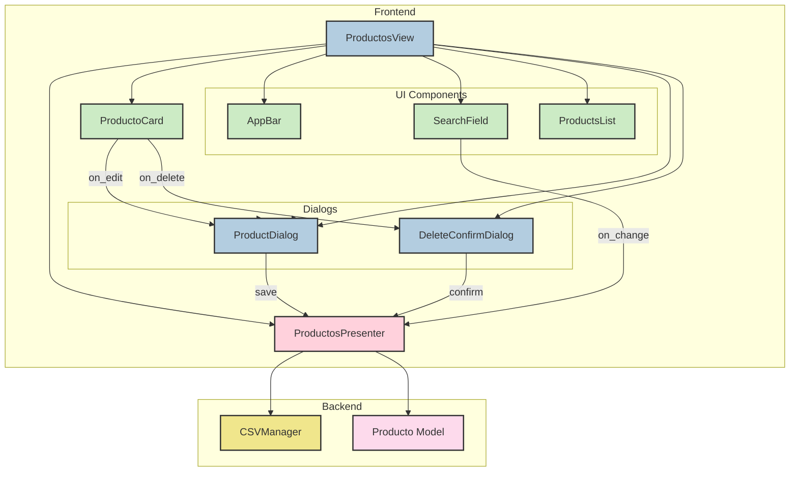

```mermaid
flowchart TB
 subgraph Dialogs["Dialogs"]
        ProductDialog["ProductDialog"]
        DeleteConfirmDialog["DeleteConfirmDialog"]
  end
 subgraph subGraph1["UI Components"]
        AppBar["AppBar"]
        SearchField["SearchField"]
        ProductsList["ProductsList"]
  end
 subgraph Frontend["Frontend"]
    direction TB
        ProductosView["ProductosView"]
        ProductoCard["ProductoCard"]
        ProductosPresenter["ProductosPresenter"]
        Dialogs
        subGraph1
  end
 subgraph Backend["Backend"]
        CSVManager["CSVManager"]
        ProductoModel["Producto Model"]
  end
    ProductosView --> ProductosPresenter & ProductoCard & AppBar & SearchField & ProductsList & ProductDialog & DeleteConfirmDialog
    ProductosPresenter --> CSVManager & ProductoModel
    ProductoCard -- on_edit --> ProductDialog
    ProductoCard -- on_delete --> DeleteConfirmDialog
    SearchField -- on_change --> ProductosPresenter
    ProductDialog -- save --> ProductosPresenter
    DeleteConfirmDialog -- confirm --> ProductosPresenter
    Frontend --> ProductDialog & ProductDialog
     ProductDialog:::view
     DeleteConfirmDialog:::view
     AppBar:::component
     SearchField:::component
     ProductsList:::component
     ProductosView:::view
     ProductoCard:::component
     ProductosPresenter:::presenter
     CSVManager:::manager
     ProductoModel:::model
    classDef presenter fill:#ffd1dc,stroke:#333,stroke-width:2px
    classDef view fill:#b3cde0,stroke:#333,stroke-width:2px
    classDef component fill:#ccebc5,stroke:#333,stroke-width:2px
    classDef model fill:#fddaec,stroke:#333,stroke-width:2px
    classDef manager fill:#f0e68c,stroke:#333,stroke-width:2px

```
