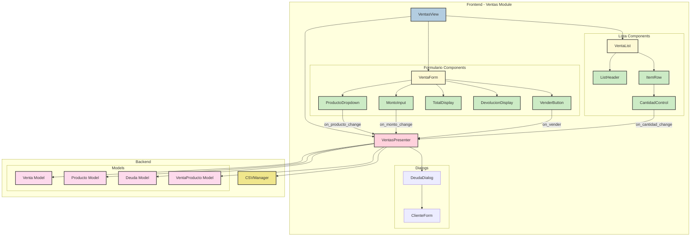

```mermaid
flowchart TB
    subgraph Frontend["Frontend - Ventas Module"]
        direction TB
        VentasView[VentasView]
        VentasPresenter[VentasPresenter]
        
        subgraph Forms["Formulario Components"]
            VentaForm[VentaForm]
            ProductoDropdown[ProductoDropdown]
            MontoInput[MontoInput]
            TotalDisplay[TotalDisplay]
            DevolucionDisplay[DevolucionDisplay]
            VenderButton[VenderButton]
        end

        subgraph Lists["Lista Components"]
            VentaList[VentaList]
            ListHeader[ListHeader]
            ItemRow[ItemRow]
            CantidadControl[CantidadControl]
        end

        subgraph Dialogs["Dialogs"]
            DeudaDialog[DeudaDialog]
            ClienteForm[ClienteForm]
        end
    end

    subgraph Backend
        CSVManager[CSVManager]
        subgraph Models
            VentaModel[Venta Model]
            ProductoModel[Producto Model]
            DeudaModel[Deuda Model]
            VentaProductoModel[VentaProducto Model]
        end
    end

    %% Relaciones principales
    VentasView --> VentasPresenter
    VentasView --> VentaForm
    VentasView --> VentaList

    %% Relaciones del formulario
    VentaForm --> ProductoDropdown
    VentaForm --> MontoInput
    VentaForm --> TotalDisplay
    VentaForm --> DevolucionDisplay
    VentaForm --> VenderButton

    %% Relaciones de la lista
    VentaList --> ListHeader
    VentaList --> ItemRow
    ItemRow --> CantidadControl

    %% Eventos y callbacks
    ProductoDropdown -->|on_producto_change| VentasPresenter
    MontoInput -->|on_monto_change| VentasPresenter
    VenderButton -->|on_vender| VentasPresenter
    CantidadControl -->|on_cantidad_change| VentasPresenter

    %% Relaciones con el backend
    VentasPresenter --> CSVManager
    VentasPresenter --> VentaModel
    VentasPresenter --> ProductoModel
    VentasPresenter --> DeudaModel
    VentasPresenter --> VentaProductoModel

    %% Flujo de deuda
    VentasPresenter --> DeudaDialog
    DeudaDialog --> ClienteForm
    
    %% Estilos
    classDef presenter fill:#ffd1dc,stroke:#333,stroke-width:2px
    classDef view fill:#b3cde0,stroke:#333,stroke-width:2px
    classDef component fill:#ccebc5,stroke:#333,stroke-width:2px
    classDef form fill:#fef9d4,stroke:#333,stroke-width:2px
    classDef model fill:#fddaec,stroke:#333,stroke-width:2px
    classDef manager fill:#f0e68c,stroke:#333,stroke-width:2px
    
    class VentasPresenter presenter
    class VentasView view
    class VentaForm,VentaList form
    class ProductoDropdown,MontoInput,TotalDisplay,DevolucionDisplay,VenderButton,ListHeader,ItemRow,CantidadControl component
    class VentaModel,ProductoModel,DeudaModel,VentaProductoModel model
    class CSVManager manager
```
