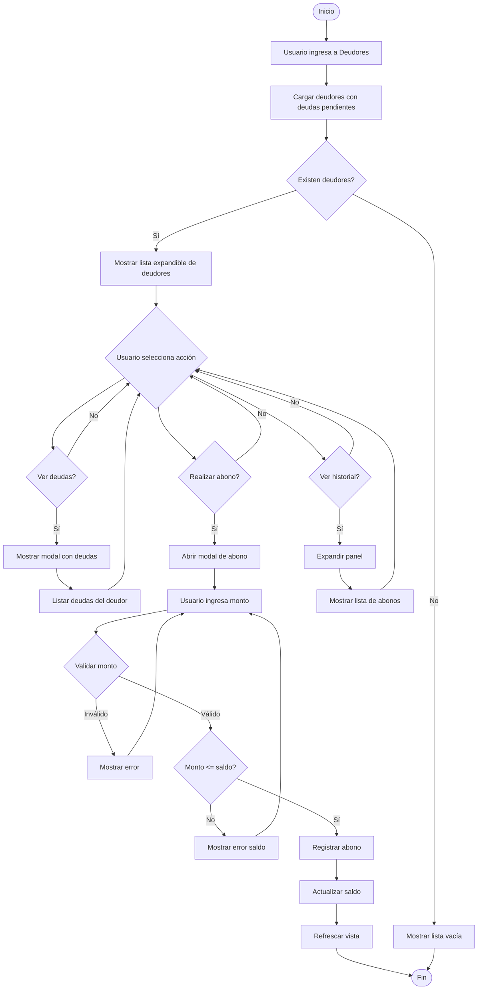

```mermaid
flowchart TB
    START([Inicio]) --> A[Usuario ingresa a Deudores]
    A --> B[Cargar deudores con deudas pendientes]
    
    B --> C{Existen deudores?}
    C -->|No| D[Mostrar lista vacía]
    C -->|Sí| E[Mostrar lista expandible de deudores]
    
    E --> F{Usuario selecciona acción}
    
    %% Flujo de Ver Deudas
    F --> G{Ver deudas?}
    G -->|Sí| H[Mostrar modal con deudas]
    H --> I[Listar deudas del deudor]
    I --> F
    
    %% Flujo de Realizar Abono
    F --> J{Realizar abono?}
    J -->|Sí| K[Abrir modal de abono]
    K --> L[Usuario ingresa monto]
    L --> M{Validar monto}
    
    M -->|Inválido| N[Mostrar error]
    N --> L
    
    M -->|Válido| O{Monto <= saldo?}
    O -->|No| P[Mostrar error saldo]
    P --> L
    
    O -->|Sí| Q[Registrar abono]
    Q --> R[Actualizar saldo]
    R --> S[Refrescar vista]
    
    %% Historial de Abonos
    F --> T{Ver historial?}
    T -->|Sí| U[Expandir panel]
    U --> V[Mostrar lista de abonos]
    V --> F
    
    %% Finalización
    S & D --> END([Fin])
    
    %% Retornos
    G -->|No| F
    J -->|No| F
    T -->|No| F
```