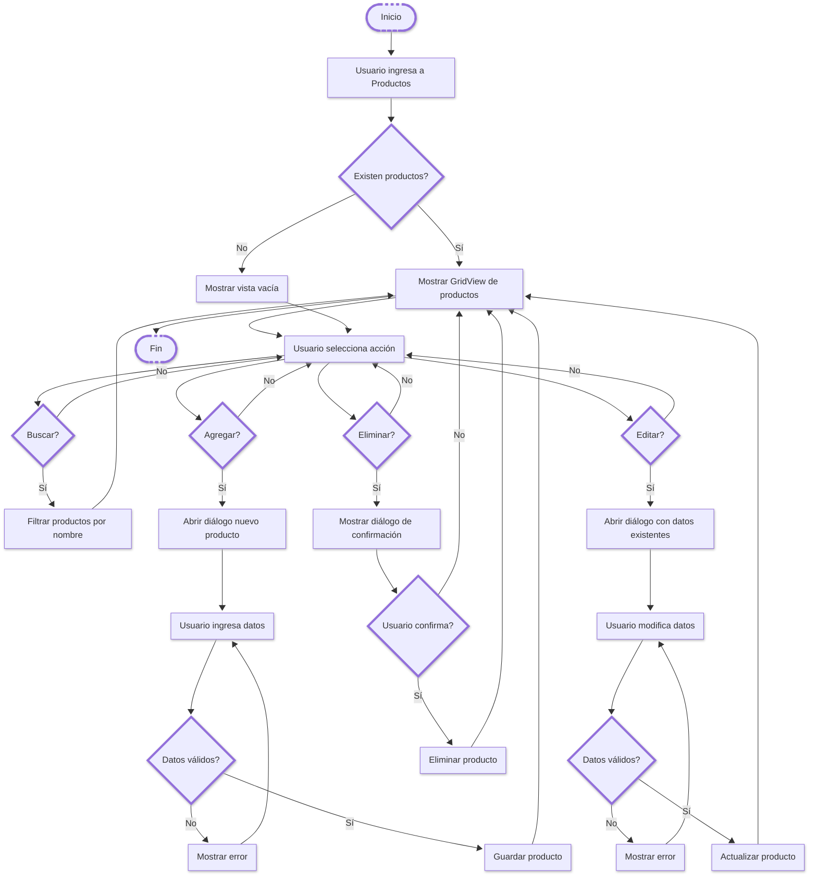

```mermaid
---
config:
  layout: fixed
  look: neo
---
flowchart TB
    START(["Inicio"]) --> A["Usuario ingresa a Productos"]
    A --> B{"Existen productos?"}
    B -- Sí --> C["Mostrar GridView de productos"]
    B -- No --> D["Mostrar vista vacía"]
    C --> E["Usuario selecciona acción"] & END(["Fin"])
    D --> E
    E --> F{"Buscar?"} & H{"Agregar?"} & N{"Editar?"} & T{"Eliminar?"}
    F -- Sí --> G["Filtrar productos por nombre"]
    G --> C
    H -- Sí --> I["Abrir diálogo nuevo producto"]
    I --> J["Usuario ingresa datos"]
    J --> K{"Datos válidos?"}
    K -- No --> L["Mostrar error"]
    L --> J
    K -- Sí --> M["Guardar producto"]
    M --> C
    N -- Sí --> O["Abrir diálogo con datos existentes"]
    O --> P["Usuario modifica datos"]
    P --> Q{"Datos válidos?"}
    Q -- No --> R["Mostrar error"]
    R --> P
    Q -- Sí --> S["Actualizar producto"]
    S --> C
    T -- Sí --> U["Mostrar diálogo de confirmación"]
    U --> V{"Usuario confirma?"}
    V -- No --> C
    V -- Sí --> W["Eliminar producto"]
    W --> C
    F -- No --> E
    H -- No --> E
    N -- No --> E
    T -- No --> E
    style START stroke-width:4px,stroke-dasharray: 5
    style B stroke-width:4px,stroke-dasharray: 0
    style END stroke-width:4px,stroke-dasharray: 5
    style F stroke-width:4px,stroke-dasharray: 0
    style H stroke-width:4px,stroke-dasharray: 0
    style N stroke-width:4px,stroke-dasharray: 0
    style T stroke-width:4px,stroke-dasharray: 0
    style K stroke-width:4px,stroke-dasharray: 0
    style Q stroke-width:4px,stroke-dasharray: 0
    style V stroke-width:4px,stroke-dasharray: 0
```
