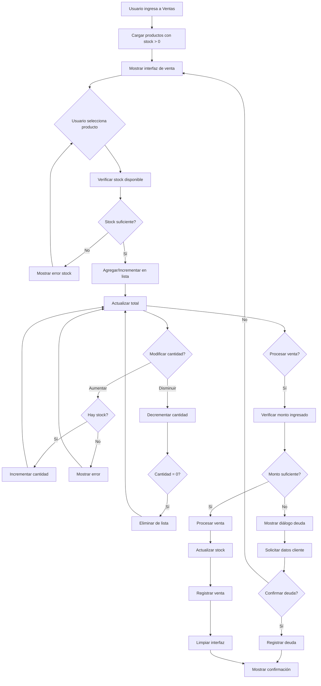

```mermaid
flowchart TD
A[Usuario ingresa a Ventas] --> B[Cargar productos con stock > 0]
B --> C[Mostrar interfaz de venta]

C --> D{Usuario selecciona producto}
D --> E[Verificar stock disponible]

E --> F{Stock suficiente?}
F -->|No| G[Mostrar error stock]
G --> D

F -->|Sí| H[Agregar/Incrementar en lista]
H --> I[Actualizar total]

I --> J{Modificar cantidad?}
J -->|Aumentar| K{Hay stock?}
K -->|Sí| L[Incrementar cantidad]
K -->|No| M[Mostrar error]

J -->|Disminuir| N[Decrementar cantidad]
N --> O{Cantidad = 0?}
O -->|Sí| P[Eliminar de lista]

L & M & P --> I

I --> Q{Procesar venta?}
Q -->|Sí| R[Verificar monto ingresado]

R --> S{Monto suficiente?}
S -->|No| T[Mostrar diálogo deuda]
T --> U[Solicitar datos cliente]
U --> V{Confirmar deuda?}
V -->|Sí| W[Registrar deuda]
V -->|No| C

S -->|Sí| X[Procesar venta]
X --> Y[Actualizar stock]
Y --> Z[Registrar venta]
Z --> AA[Limpiar interfaz]

W & AA --> BB[Mostrar confirmación]
```
