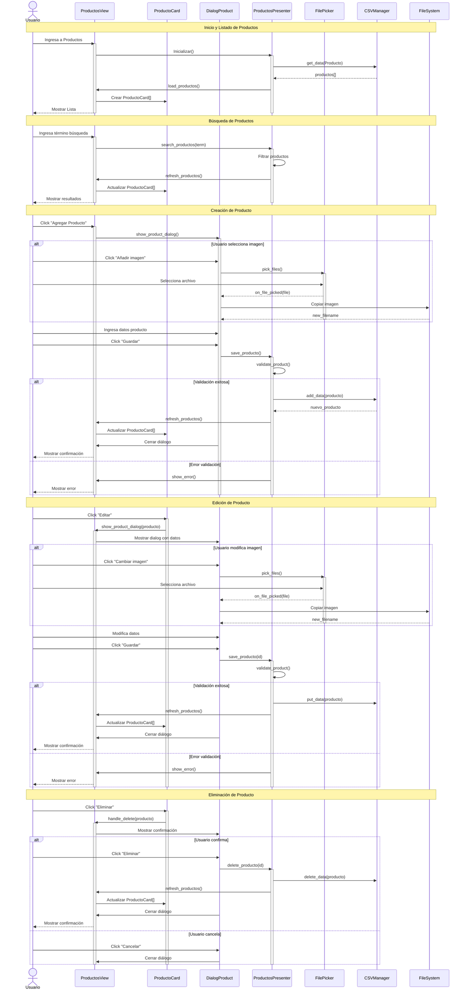

```mermaid
sequenceDiagram
    actor Usuario
    participant ProductosView
    participant ProductoCard
    participant DialogProduct
    participant ProductosPresenter
    participant FilePicker
    participant CSVManager
    participant FileSystem

    Note over Usuario,FileSystem: Inicio y Listado de Productos
    Usuario->>ProductosView: Ingresa a Productos
    activate ProductosView
    ProductosView->>ProductosPresenter: Inicializar()
    activate ProductosPresenter
    ProductosPresenter->>CSVManager: get_data(Producto)
    CSVManager-->>ProductosPresenter: productos[]
    ProductosPresenter->>ProductosView: load_productos()
    ProductosView->>ProductoCard: Crear ProductoCard[]
    ProductosView-->>Usuario: Mostrar Lista
    deactivate ProductosPresenter
    deactivate ProductosView

    Note over Usuario,FileSystem: Búsqueda de Productos
    Usuario->>ProductosView: Ingresa término búsqueda
    activate ProductosView
    ProductosView->>ProductosPresenter: search_productos(term)
    activate ProductosPresenter
    ProductosPresenter->>ProductosPresenter: Filtrar productos
    ProductosPresenter->>ProductosView: refresh_productos()
    ProductosView->>ProductoCard: Actualizar ProductoCard[]
    ProductosView-->>Usuario: Mostrar resultados
    deactivate ProductosPresenter
    deactivate ProductosView

    Note over Usuario,FileSystem: Creación de Producto
    Usuario->>ProductosView: Click "Agregar Producto"
    activate ProductosView
    ProductosView->>DialogProduct: show_product_dialog()
    activate DialogProduct

    alt Usuario selecciona imagen
        Usuario->>DialogProduct: Click "Añadir imagen"
        DialogProduct->>FilePicker: pick_files()
        activate FilePicker
        Usuario->>FilePicker: Selecciona archivo
        FilePicker-->>DialogProduct: on_file_picked(file)
        DialogProduct->>FileSystem: Copiar imagen
        FileSystem-->>DialogProduct: new_filename
        deactivate FilePicker
    end

    Usuario->>DialogProduct: Ingresa datos producto
    Usuario->>DialogProduct: Click "Guardar"
    DialogProduct->>ProductosPresenter: save_producto()
    activate ProductosPresenter
    ProductosPresenter->>ProductosPresenter: validate_product()

    alt Validación exitosa
        ProductosPresenter->>CSVManager: add_data(producto)
        CSVManager-->>ProductosPresenter: nuevo_producto
        ProductosPresenter->>ProductosView: refresh_productos()
        ProductosView->>ProductoCard: Actualizar ProductoCard[]
        DialogProduct->>ProductosView: Cerrar diálogo
        ProductosView-->>Usuario: Mostrar confirmación
    else Error validación
        ProductosPresenter->>ProductosView: show_error()
        ProductosView-->>Usuario: Mostrar error
    end
    deactivate ProductosPresenter
    deactivate DialogProduct
    deactivate ProductosView

    Note over Usuario,FileSystem: Edición de Producto
    Usuario->>ProductoCard: Click "Editar"
    activate ProductoCard
    ProductoCard->>ProductosView: show_product_dialog(producto)
    activate ProductosView
    ProductosView->>DialogProduct: Mostrar dialog con datos

    alt Usuario modifica imagen
        Usuario->>DialogProduct: Click "Cambiar imagen"
        DialogProduct->>FilePicker: pick_files()
        activate FilePicker
        Usuario->>FilePicker: Selecciona archivo
        FilePicker-->>DialogProduct: on_file_picked(file)
        DialogProduct->>FileSystem: Copiar imagen
        FileSystem-->>DialogProduct: new_filename
        deactivate FilePicker
    end

    Usuario->>DialogProduct: Modifica datos
    Usuario->>DialogProduct: Click "Guardar"
    DialogProduct->>ProductosPresenter: save_producto(id)
    activate ProductosPresenter
    ProductosPresenter->>ProductosPresenter: validate_product()

    alt Validación exitosa
        ProductosPresenter->>CSVManager: put_data(producto)
        ProductosPresenter->>ProductosView: refresh_productos()
        ProductosView->>ProductoCard: Actualizar ProductoCard[]
        DialogProduct->>ProductosView: Cerrar diálogo
        ProductosView-->>Usuario: Mostrar confirmación
    else Error validación
        ProductosPresenter->>ProductosView: show_error()
        ProductosView-->>Usuario: Mostrar error
    end
    deactivate ProductosPresenter
    deactivate ProductosView
    deactivate ProductoCard

    Note over Usuario,FileSystem: Eliminación de Producto
    Usuario->>ProductoCard: Click "Eliminar"
    activate ProductoCard
    ProductoCard->>ProductosView: handle_delete(producto)
    activate ProductosView
    ProductosView->>DialogProduct: Mostrar confirmación

    alt Usuario confirma
        Usuario->>DialogProduct: Click "Eliminar"
        DialogProduct->>ProductosPresenter: delete_producto(id)
        activate ProductosPresenter
        ProductosPresenter->>CSVManager: delete_data(producto)
        ProductosPresenter->>ProductosView: refresh_productos()
        ProductosView->>ProductoCard: Actualizar ProductoCard[]
        DialogProduct->>ProductosView: Cerrar diálogo
        ProductosView-->>Usuario: Mostrar confirmación
    else Usuario cancela
        Usuario->>DialogProduct: Click "Cancelar"
        DialogProduct->>ProductosView: Cerrar diálogo
    end
    deactivate ProductosPresenter
    deactivate ProductosView
    deactivate ProductoCard
```
