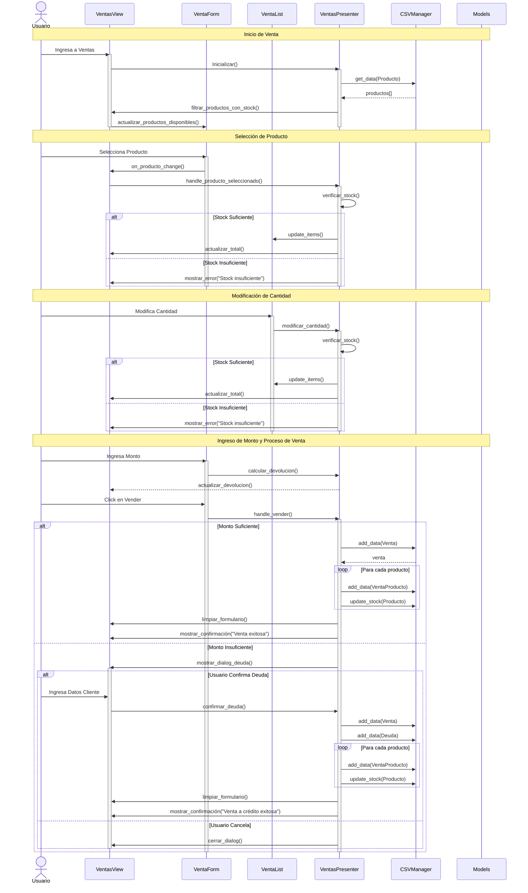

```mermaid
sequenceDiagram
    actor Usuario
    participant VentasView
    participant VentaForm
    participant VentaList
    participant VentasPresenter
    participant CSVManager
    participant Models

    Note over Usuario,Models: Inicio de Venta
    Usuario->>VentasView: Ingresa a Ventas
    activate VentasView
    VentasView->>VentasPresenter: Inicializar()
    activate VentasPresenter
    VentasPresenter->>CSVManager: get_data(Producto)
    CSVManager-->>VentasPresenter: productos[]
    VentasPresenter->>VentasView: filtrar_productos_con_stock()
    VentasView->>VentaForm: actualizar_productos_disponibles()
    deactivate VentasPresenter
    deactivate VentasView

    Note over Usuario,Models: Selección de Producto
    Usuario->>VentaForm: Selecciona Producto
    activate VentaForm
    VentaForm->>VentasView: on_producto_change()
    VentasView->>VentasPresenter: handle_producto_seleccionado()
    activate VentasPresenter
    VentasPresenter->>VentasPresenter: verificar_stock()
    alt Stock Suficiente
        VentasPresenter->>VentaList: update_items()
        VentasPresenter->>VentasView: actualizar_total()
    else Stock Insuficiente
        VentasPresenter->>VentasView: mostrar_error("Stock insuficiente")
    end
    deactivate VentasPresenter
    deactivate VentaForm

    Note over Usuario,Models: Modificación de Cantidad
    Usuario->>VentaList: Modifica Cantidad
    activate VentaList
    VentaList->>VentasPresenter: modificar_cantidad()
    activate VentasPresenter
    VentasPresenter->>VentasPresenter: verificar_stock()
    alt Stock Suficiente
        VentasPresenter->>VentaList: update_items()
        VentasPresenter->>VentasView: actualizar_total()
    else Stock Insuficiente
        VentasPresenter->>VentasView: mostrar_error("Stock insuficiente")
    end
    deactivate VentasPresenter
    deactivate VentaList

    Note over Usuario,Models: Ingreso de Monto y Proceso de Venta
    Usuario->>VentaForm: Ingresa Monto
    activate VentaForm
    VentaForm->>VentasPresenter: calcular_devolucion()
    VentasPresenter-->>VentasView: actualizar_devolucion()
    Usuario->>VentaForm: Click en Vender
    VentaForm->>VentasPresenter: handle_vender()
    activate VentasPresenter
    
    alt Monto Suficiente
        VentasPresenter->>CSVManager: add_data(Venta)
        CSVManager-->>VentasPresenter: venta
        loop Para cada producto
            VentasPresenter->>CSVManager: add_data(VentaProducto)
            VentasPresenter->>CSVManager: update_stock(Producto)
        end
        VentasPresenter->>VentasView: limpiar_formulario()
        VentasPresenter->>VentasView: mostrar_confirmación("Venta exitosa")
    else Monto Insuficiente
        VentasPresenter->>VentasView: mostrar_dialog_deuda()
        activate VentasView
        alt Usuario Confirma Deuda
            Usuario->>VentasView: Ingresa Datos Cliente
            VentasView->>VentasPresenter: confirmar_deuda()
            VentasPresenter->>CSVManager: add_data(Venta)
            VentasPresenter->>CSVManager: add_data(Deuda)
            loop Para cada producto
                VentasPresenter->>CSVManager: add_data(VentaProducto)
                VentasPresenter->>CSVManager: update_stock(Producto)
            end
            VentasPresenter->>VentasView: limpiar_formulario()
            VentasPresenter->>VentasView: mostrar_confirmación("Venta a crédito exitosa")
        else Usuario Cancela
            VentasPresenter->>VentasView: cerrar_dialog()
        end
        deactivate VentasView
    end
    deactivate VentasPresenter
    deactivate VentaForm
```
